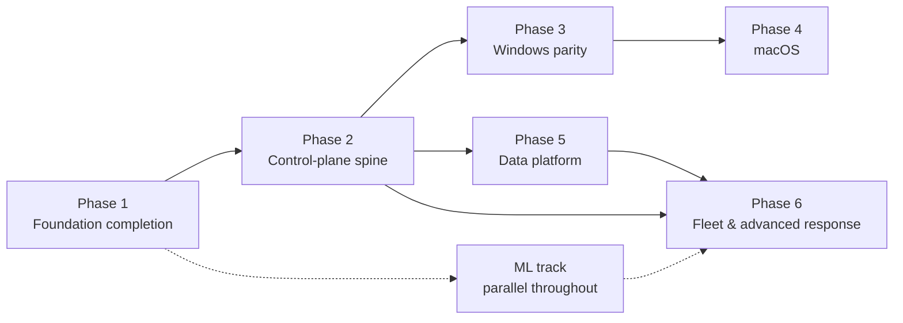

# Roadmap — Dependency-Ordered Development Plan

Derived from the interdependencies of all open issues (2026-09-03; hardening
backlog #107–#114 from the migration PR reviews slotted in on 2026-09-04). Rule of reading:
work *within* a phase is parallel-safe; a phase's start depends only on the arrows
into it. Issue numbers are the source of truth for scope; this file only orders them.

## The critical path in one sentence

**`#23 policy → #24 transport + #28 server(+#89 auth) → #30 updater/rings → #77
datalake`** — every fleet-level feature (M6) hangs off this spine; nothing else in
the backlog blocks as much as these six issues.

## Phase 0 — In flight

- #17 yara (PR green, awaiting merge) · #13 ml inference (parallel session)

## Phase 1 — Foundation completion (all parallel, agent-local, no blockers)

| Issue | Why now |
| --- | --- |
| #19 config | agent/watchdog/cli all want it; tiny; blocks nothing but tidies everything |
| #53 CO-RE ppid fix | every lineage rule is unreliable off the binding kernel until this lands; also prerequisite for trusting #62 blast-radius and #48 lineage features |
| #67 baseline capture | small; unblocks #44's benign campaign |
| #74 ATT&CK structured fields | schema+engines only; the earlier it lands, the less content needs retrofitting; #73 metadata lint depends on it |
| #73 (metadata + negative samples half) | content-side only; ring half moves to Phase 2 (#30) |
| #34 audit fallback sensor | independent; second Linux sensor → makes #35 conformance meaningful |
| #80 container context | Linux sensor + schema; feeds #72/#76 later but standalone now |
| #36 packaging: Linux | unblocks realistic lab installs for every later phase's validation |
| **Source collection** — #90 uprobes · #91 lsm · #92 netlink · #93 journal | new Linux telemetry taps: agent-local, parallel-safe, validated on the existing lab; #91 additionally opens the Linux inline-blocking path #25 will use |
| #84 device-control (Linux telemetry half) · #86 JA4/SNI | sensor-side collection, same profile; control/policy halves return in later phases |
| #87 inventory (agent half) | diffed collectors are agent-local; graph/prevalence consumers arrive with Phase 5 |
| #114 schema version-bump contract | doc-only decision; the earlier it lands, the fewer schema additions get re-litigated |
| #111 probe filename capture | same eBPF probe rebuild as #53 — do together; kills argv[0] spoofing and fixes enrich hashing the wrong file |
| #112 watchdog service hardening | agent-local (service args, quoting, absolute paths); pairs naturally with #36/#37 packaging |
| #113 lab provisioning fixes | restores the scenario reliability every later phase's validation leans on |

## Phase 2 — Control-plane spine (the great unblocker; mostly serial)

1. **#23 policy** — response gating, posture overlays, content rings all speak it; first
2. **#28 server scaffold + #89 better-auth/tenancy** — one PR train: tenancy shapes migration one (ADR-0003)
3. **#24 transport + #108 spool ack** — enrollment + spool flush against #28; mTLS in
   front per ADR-0001. The spool's two-phase drain/ack (#108) lands here: the server is
   the first real consumer of drained segments, and the ack protocol is its contract
4. **#30 updater + rings** — needs #24/#28; completes #73 (content rings); prerequisite for #71's integrity manifest
5. **#25 response** — needs #23 only; can run parallel to 2–4; Linux kill/quarantine first (the LSM block path arrives with #91)
6. **#26 ipc → #27 cli → #31 ui** — strictly after #26; ui also wants #25 (notifications)

## Phase 3 — Windows parity (needs Phase 1 lab discipline; independent of Phase 5)

1. **#22 Windows lab harness** — gate for everything Windows; needs the x86 host
2. **#20 ETW migration (F-1..F-7)** — validated on #22
3. **#21 P2–P8 expansion · #94 eventlog · #97 DotNET/SMB providers** — parallel after #20
4. **#37 packaging: Windows** — after #20 (services to install)
5. **#35 conformance suite** — becomes honest once Linux(2 sensors)+Windows exist; generates the public matrix

## Phase 4 — macOS (this Mac is the lab; after Phase 3 only by team focus, not by dependency)

**#32 ES sensor → #96 ES widening → #33 NetworkExtension · #95 unifiedlog → #38 packaging**

## Phase 5 — Data & analytics platform (hard-gated on #28; the M6 substrate)

1. **#77 datalake** — everything below reads it
2. **#72 graph · #76 prevalence · #83 ops** — parallel projections/consumers
3. **#61 hunt · #78 cloud-detection** — need #77 (+#72 for pivots)
4. **#29 export/SIEM · #88 integrations** — need #28 only; can start any time in this phase

## Phase 6 — Fleet & advanced response (each item lists its true gates)

| Issue | Gates |
| --- | --- |
| #60 intel | schema Ioc variant; distribution via #30; enrich ✅ |
| #62 fleet correlation + posture | #28, #72-ish joins, #23 overlays; quality wants #53 ✅ (done in P1) |
| #79 mesh | #24 PKI + #62 posture semantics |
| #63 response::live | #24 + #28 + #89 identities |
| #70 forensics | #63 (acquisitions channel) + #77 (artifact storage) |
| #64 disruption | #25 + #62 + #89 (+ directory connector) |
| #71 tamper | heartbeat half + #92 cross-check: after Phase 1; integrity half: #30 manifest |
| #81 deception → #82 ransomware | #81 first; #82 also wants Windows rename/delete events (#39 driver or #21 partials) and #25 reflex |
| #84 (policy-enforcement half) | #23 policy; telemetry half done in Phase 1 |
| #85 memory scanning | Linux half after #91 (Phase 1); Windows half gated on #39 (TI-ETW/PPL) |
| #75 assistant | #72 + cases in #28; pairs with #50 |
| #39 windows driver | long-term: signing/MVI gates; unblocks #85-win, #82 fidelity, handle-access |
| #107 trusted-process identity | the path-trust gate already shipped (PR #106); the durable signature + expected-parent verification wants publisher identity from enrich (#21 catalog chain on Windows) |

## ML track (parallel throughout, owned alongside #13)

**#13 → {#109 format parity, #110 ort static linking} → #44 corpus (wants #67, #36) →
{#45 robustness, #46 conformal/OOD, #48 lineage features (wants #53)} → #49 per-site
adaptation (wants #28 + #77) → #50 narratives (with #75)**. #47 attributions is
partially landed. #109/#110 come first: the corpus pipeline must read real agent
captures, and the deployed scorer must match ADR-0002 before anything is trained
against it.

## Suggested batch order (if one thread does everything)

1–2 first (foundation, then spine), 5 immediately after #28 exists, 3 when the x86
host is available (calendar-gated, so slot it opportunistically), 6 by the gates
table, 4 last before fleet-wide claims, #39 whenever the signing path opens.
