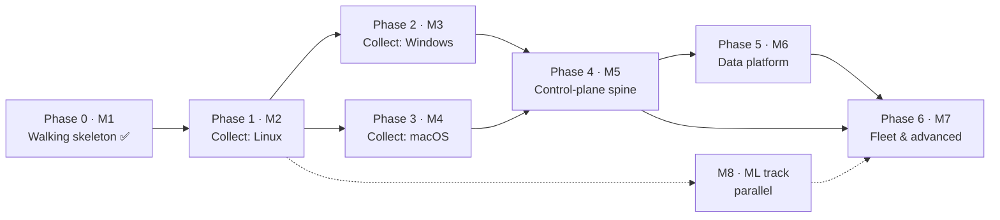

# Roadmap

Dependency-ordered development plan, derived from the interdependencies of all open
issues. **Two orderings, one structure:** the *phases* below are the dependency graph
(what unblocks what), and the GitHub *milestones* are those same phases (M1–M8), so an
issue's milestone is its phase. Work *within* a phase is parallel-safe; a phase starts
when the arrows into it land. Issue numbers are the source of truth for scope; this
file only orders them.

Last reviewed 2026-09-04.

## Product philosophy: collect first, everywhere

An EDR is only as good as the telemetry it captured. **You cannot retroactively detect
on data you never collected** — but you *can* replay new detections over data you did
keep (retrospective detection, #78). So the early phases maximize telemetry breadth on
each platform *before* the higher layers. Collection is the moat: the kernel-sourced
signal an attacker cannot unhook, and the fleet-derived signal they cannot rehearse by
downloading our binaries.

This is why the first active phases are **per-platform data gathering** — Linux, then
Windows, then macOS — and the control-plane spine comes *after* them, not before. The
agent runs and spools standalone (the walking skeleton proved it), so broad collection
does not wait on a server; the plane arrives later to drain and analyze what the agents
already gathered. The trade-off is deliberate: single-endpoint telemetry richness
first, central fleet management second.

## Milestones = phases

| Milestone | Phase | Theme | State |
| --- | --- | --- | --- |
| M1 — Linux walking skeleton | 0 | one event end to end | ✅ done |
| M2 — Linux telemetry & foundation | 1 | **collect: Linux** | in progress |
| M3 — Windows telemetry breadth | 2 | **collect: Windows** | sensor landed; expansion open |
| M4 — macOS telemetry breadth | 3 | **collect: macOS** | not started |
| M5 — Control-plane spine | 4 | ship & manage | not started |
| M6 — Data & analytics platform | 5 | store & query | not started |
| M7 — Fleet & advanced response | 6 | act at fleet scale | not started |
| M8 — ML track | parallel | learn from the data | inference landed; pipeline open |

Milestone numbers ascend with the dependency order. Every new issue is filed straight
into its phase's milestone.

## Current state

- **Done:** the Linux walking skeleton (M1), the detection engines (sigma, correlator,
  ML inference, store, enrich, yara), the Windows ETW sensor, the Python training
  pipeline, the review-findings hardening and Clean Code passes, and the
  self-protection primitives (sensor-silence heartbeat + self-integrity in `tamper`).
- **In flight (M2 / Phase 1):** maximizing Linux telemetry + the agent-local
  foundation — where day-to-day work sits until the collection surface is rich.
- **Collection phases run as labs allow:** Windows (M3) is gated on the x86 host;
  macOS (M4) is this Mac. They can proceed in parallel with late Phase-1 work.

## The critical path in one sentence

Collect broadly on every platform (**M2 → M3 → M4**), then stand up the spine
(**`#23 policy → #24 transport + #28 server (+#89 auth) → #30 updater/rings`**) that
lets **#77 datalake** and every fleet feature consume it.

## Phase 0 — Walking skeleton ✅ (M1)

One synthetic event end to end on Linux: schema, eBPF probes + userspace loader, rule
engine, sinks, the agent binary, watchdog, lab harness. Complete. The detection engines,
the Windows ETW sensor (#20), the hardening passes, and the `tamper` self-protection
primitives also landed here, ahead of their nominal slots.

## Phase 1 — Collect: Linux (M2) · maximize Linux telemetry + agent-local foundation

*Everything the Linux platform exposes, plus the plumbing a rich agent needs. All
parallel, agent-local, no blockers.*

| Issue | Why now |
| --- | --- |
| **Source collection** — #90 uprobes · #91 lsm · #92 netlink · #93 journal | the new Linux telemetry taps — the heart of Phase 1; parallel-safe, validated on the lab; #91 also opens the inline-blocking path #25 uses |
| #34 audit fallback sensor | a second collection path for hosts without eBPF; makes #35 conformance meaningful |
| #80 container context · #86 JA4/SNI · #84 device-control (telemetry) · #87 inventory | more collection surface — container attribution, network fingerprints, USB, asset diffs; the analysis consumers arrive later |
| #53 CO-RE ppid fix · #111 probe filename · #126 async enrichment | collection *quality*: reliable lineage off the binding kernel, un-spoofable image names, and keeping enrichment off the sensor drain thread |
| #74 ATT&CK structured fields · #73 detection-as-code · #114 schema contract | the shared spine every collected event and detection lands on |
| #19 config · #36 packaging: Linux · #112 watchdog hardening · #113 provisioning · #123 Alpine lab · #124 Arch lab | the agent-local foundation + the musl / rolling-kernel test beds (#124 is the CO-RE #53 proving ground) |
| #71 tamper · #101 backoff · #102 liveness · #103 artifact protection · #104 spike | self-protection: heartbeat + integrity shipped; wiring them in and hardening the restart loop remains |

## Phase 2 — Collect: Windows (M3) · needs the x86 lab host; independent of macOS

*Everything Windows exposes. The agent spools locally — no control plane required yet.*

1. **#22 Windows lab harness** — the gate; needs the x86 host.
2. **#20 ETW migration ✅** — code landed; lab validation on #22 still owed.
3. **#21 P2–P8 expansion · #94 eventlog · #97 DotNET/SMB providers** — the breadth: registry, DNS, image load, AMSI, WMI, event-log channels, .NET/SMB/RPC. Code-unblocked now, validation wants #22.
4. **#37 packaging: Windows** — services to install after #20.
5. **#35 conformance suite** — honest once Linux (2 sensors) + Windows exist; generates the public capability matrix.

## Phase 3 — Collect: macOS (M4) · this Mac is the lab; parallel with Phase 2

*Everything macOS exposes.*

**#32 ES sensor → #96 ES widening (login/session, xattr/quarantine, mount, signal, XPC)
→ #33 NetworkExtension · #95 unified-log → #38 packaging**

## Phase 4 — Control-plane spine (M5) · built once the agents collect broadly

*Now ship, store, and manage what the endpoints gathered. The great unblocker for
everything fleet-level; mostly serial.*

1. **#23 policy** — response gating, posture overlays, content rings all speak it; first.
2. **#28 server scaffold + #89 better-auth/tenancy** — one PR train: tenancy shapes migration one (ADR-0003).
3. **#24 transport + #108 spool ack** — enrollment + spool flush against #28; mTLS per ADR-0001. The server is the first real consumer of the drained spool.
4. **#30 updater + rings** — needs #24/#28; completes #73's content rings; prerequisite for #71's integrity manifest.
5. **#25 response** — needs #23 only; parallel to 2–4; Linux kill/quarantine first (LSM block path from #91).
6. **#26 ipc → #27 cli → #31 ui** — strictly ordered; ui also wants #25 for notifications.

## Phase 5 — Data & analytics platform (M6) · hard-gated on #28

1. **#77 datalake** — the substrate; everything below reads it, and it makes yesterday's collected telemetry replayable.
2. **#72 graph · #76 prevalence · #83 ops** — parallel projections over it.
3. **#61 hunt · #78 cloud-detection** — need #77 (+#72 for pivots); #78 is where retrospective detection over the collected history lives.
4. **#29 export/SIEM · #88 integrations** — need #28 only; start any time in this phase.

## Phase 6 — Fleet & advanced response (M7) · each item lists its true gates

| Issue | Gates |
| --- | --- |
| #60 intel | schema Ioc variant; distribution via #30; enrich ✅ |
| #62 fleet correlation + posture | #28, #72 joins, #23 overlays; quality wants #53 |
| #79 mesh | #24 PKI + #62 posture semantics |
| #63 response::live | #24 + #28 + #89 identities |
| #70 forensics | #63 (acquisitions) + #77 (artifact storage) |
| #64 disruption | #25 + #62 + #89 (+ directory connector) |
| #81 deception → #82 ransomware | #81 first; #82 also wants Windows rename/delete events (#39 or #21 partials) and #25 reflex |
| #84 device-control (enforcement half) | #23 policy; telemetry half done in Phase 1 |
| #85 memory scanning | Linux half after #91; Windows half gated on #39 (TI-ETW/PPL) |
| #75 assistant | #72 + cases in #28; pairs with #50 |
| #107 trusted-process identity | path-trust gate shipped (PR #106); durable signature + expected-parent check wants enrich publisher identity (#21) |
| #39 windows driver | long-term: signing/MVI gates; unblocks #85-win, #82 fidelity, handle-access |

## M8 — ML track (parallel throughout, owned alongside the shipped #13)

**#13 ✅ → {#109 format parity, #110 ort static linking} → #44 corpus (#67 ✅; wants
#36) → {#45 robustness, #46 conformal/OOD, #48 lineage features (wants #53)} → #49
per-site adaptation (wants #28 + #77) → #50 narratives (with #75)**. #47 attributions
is partially landed. The ML track feeds on the telemetry the collection phases gather:
richer sources (Phase 1–3) mean richer features, so it advances in step with them.
#109/#110 come first — the corpus pipeline must read real agent captures, and the
deployed scorer must match ADR-0002 before anything is trained against it.

## If one thread does everything

Collect first: Phase 1 (Linux) now, Phases 2–3 (Windows, macOS) as their labs come
online — the x86 host gates Windows, this Mac is macOS. Only then Phase 4 (the spine),
because it exists to serve data that already exists. Phase 5 (data platform) follows
the server; Phase 6 by its gates table. The ML track runs alongside throughout, pacing
with the collection surface.
