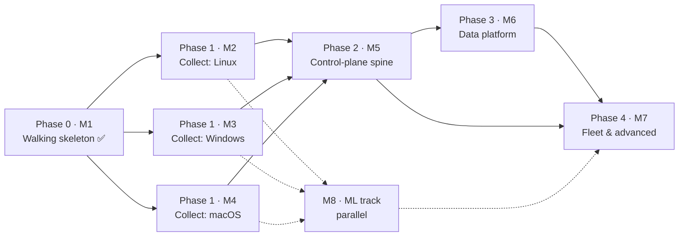

# Roadmap

Dependency-ordered development plan, derived from the interdependencies of all open
issues. Work *within* a phase is parallel-safe; a phase starts when the arrows into it
land. Issue numbers are the source of truth for scope; this file only orders them.

Last reviewed 2026-09-04.

## Product philosophy: collect first, everywhere — on every platform at once

An EDR is only as good as the telemetry it captured. **You cannot retroactively detect
on data you never collected** — but you *can* replay new detections over data you did
keep (retrospective detection, #78). So the early work maximizes telemetry breadth, and
it does so on **all three platforms in parallel**: Linux, Windows, and macOS collection
are independent tracks that share only the already-done schema/`Sensor` contract, so
none waits on another. Each is gated solely by its own lab (the x86 host for Windows,
this Mac for macOS, the existing Vagrant boxes for Linux).

Collection is the moat — the kernel-sourced signal an attacker cannot unhook, the
fleet-derived signal they cannot rehearse — so it comes *before* the higher layers. The
agent runs and spools standalone (the walking skeleton proved it), so broad collection
does not wait on a server; the control-plane arrives afterwards to drain and analyze
what the agents already gathered. The trade-off is deliberate: endpoint telemetry
richness across every platform first, central fleet management second.

## Milestones = phases

| Milestone | Phase | Theme | State |
| --- | --- | --- | --- |
| M1 — Linux walking skeleton | 0 | one event end to end | ✅ done |
| M2 — Linux telemetry & foundation | 1 · track A | **collect: Linux** | in progress |
| M3 — Windows telemetry breadth | 1 · track B | **collect: Windows** | sensor landed; expansion open |
| M4 — macOS telemetry breadth | 1 · track C | **collect: macOS** | not started |
| M5 — Control-plane spine | 2 | ship & manage | not started |
| M6 — Data & analytics platform | 3 | store & query | not started |
| M7 — Fleet & advanced response | 4 | act at fleet scale | not started |
| M8 — ML track | parallel | learn from the data | inference landed; pipeline open |

**Phase 1 is three parallel milestones (M2/M3/M4)** — one per platform, developed
simultaneously. Everything downstream (M5–M7) starts once collection is broad enough
across the fleet. Every new issue is filed straight into its milestone.

## Current state

- **Done:** the Linux walking skeleton (M1), the detection engines (sigma, correlator,
  ML inference, store, enrich, yara), the Windows ETW sensor, the Python training
  pipeline, the review-findings hardening and Clean Code passes, and the
  self-protection primitives (heartbeat + self-integrity in `tamper`).
- **In flight (Phase 1, all three tracks):** maximizing telemetry on Linux (M2),
  Windows (M3), and macOS (M4) at once, plus the agent-local foundation on the Linux
  track. Each advances as its lab allows.

## The critical path in one sentence

Collect broadly on **all platforms in parallel** (M2 ∥ M3 ∥ M4), then stand up the spine
(**`#23 policy → #24 transport + #28 server (+#89 auth) → #30 updater/rings`**) that lets
**#77 datalake** and every fleet feature consume it.

## Phase 0 — Walking skeleton ✅ (M1)

One synthetic event end to end on Linux: schema, eBPF probes + userspace loader, rule
engine, sinks, the agent binary, watchdog, lab harness. Complete. The detection engines,
the Windows ETW sensor (#20), the hardening passes, and the `tamper` self-protection
primitives also landed here, ahead of their nominal slots. **The schema/`Sensor`
contract this delivered is the only thing the three Phase-1 platform tracks share — so
they can all proceed at once.**

## Phase 1 — Collect, on every platform in parallel

Three independent tracks, developed simultaneously; each gated only by its own lab.

### Track A · Linux (M2) — maximize Linux telemetry + agent-local foundation

| Issue | Why now |
| --- | --- |
| **Source collection** — #90 uprobes · #91 lsm · #92 netlink · #93 journal | the new Linux telemetry taps — the heart of the Linux track; #91 also opens the inline-blocking path #25 uses |
| #34 audit fallback sensor | a second collection path for hosts without eBPF; makes #35 conformance meaningful |
| #80 container context · #86 JA4/SNI · #84 device-control (telemetry) · #87 inventory | more collection surface — container attribution, network fingerprints, USB, asset diffs |
| #53 CO-RE ppid fix · #111 probe filename · #126 async enrichment | collection *quality*: reliable lineage off the binding kernel, un-spoofable image names, enrichment off the drain thread |
| #74 ATT&CK fields · #73 detection-as-code · #114 schema contract | the shared spine every collected event and detection lands on |
| #19 config · #36 packaging: Linux · #112 watchdog hardening · #113 provisioning · #123 Alpine lab · #124 Arch lab | agent-local foundation + the musl / rolling-kernel test beds (#124 is the CO-RE #53 proving ground) |
| #71 tamper · #101 backoff · #102 liveness · #103 artifact protection · #104 spike | self-protection: heartbeat + integrity shipped; wiring + restart-loop hardening remain |

### Track B · Windows (M3) — maximize Windows telemetry

Gated on the x86 lab host; otherwise independent.

1. **#22 Windows lab harness** — the gate; needs the x86 host.
2. **#20 ETW migration ✅** — code landed; lab validation on #22 still owed.
3. **#21 P2–P8 expansion · #94 eventlog · #97 DotNET/SMB providers** — the breadth: registry, DNS, image load, AMSI, WMI, event-log channels, .NET/SMB/RPC.
4. **#37 packaging: Windows** — services to install after #20.
5. **#35 conformance suite** — honest once Linux (2 sensors) + Windows exist; the public capability matrix.

### Track C · macOS (M4) — maximize macOS telemetry

This Mac is the lab; otherwise independent.

**#32 ES sensor → #96 ES widening (login/session, xattr/quarantine, mount, signal, XPC)
→ #33 NetworkExtension · #95 unified-log → #38 packaging**

## Phase 2 — Control-plane spine (M5) · built once the agents collect broadly

*Now ship, store, and manage what the endpoints gathered. The great unblocker; mostly
serial.*

1. **#23 policy** — response gating, posture overlays, content rings all speak it; first.
2. **#28 server scaffold + #89 better-auth/tenancy** — one PR train: tenancy shapes migration one (ADR-0003).
3. **#24 transport + #108 spool ack** — enrollment + spool flush against #28; mTLS per ADR-0001; the server is the first real consumer of the drained spool.
4. **#30 updater + rings** — needs #24/#28; completes #73's content rings; prerequisite for #71's integrity manifest.
5. **#25 response** — needs #23 only; parallel to 2–4; Linux kill/quarantine first (LSM block path from #91).
6. **#26 ipc → #27 cli → #31 ui** — strictly ordered; ui also wants #25 for notifications.

## Phase 3 — Data & analytics platform (M6) · hard-gated on #28

1. **#77 datalake** — the substrate; makes yesterday's collected telemetry replayable.
2. **#72 graph · #76 prevalence · #83 ops** — parallel projections over it.
3. **#61 hunt · #78 cloud-detection** — need #77 (+#72 for pivots); #78 is retrospective detection over collected history.
4. **#29 export/SIEM · #88 integrations** — need #28 only; start any time in this phase.

## Phase 4 — Fleet & advanced response (M7) · each item lists its true gates

| Issue | Gates |
| --- | --- |
| #60 intel | schema Ioc variant; distribution via #30; enrich ✅ |
| #62 fleet correlation + posture | #28, #72 joins, #23 overlays; quality wants #53 |
| #79 mesh | #24 PKI + #62 posture semantics |
| #63 response::live | #24 + #28 + #89 identities |
| #70 forensics | #63 (acquisitions) + #77 (artifact storage) |
| #64 disruption | #25 + #62 + #89 (+ directory connector) |
| #81 deception → #82 ransomware | #81 first; #82 also wants Windows rename/delete events (#39 or #21 partials) and #25 reflex |
| #84 device-control (enforcement half) | #23 policy; telemetry half done in Phase 1 |
| #85 memory scanning | Linux half after #91; Windows half gated on #39 (TI-ETW/PPL) |
| #75 assistant | #72 + cases in #28; pairs with #50 |
| #107 trusted-process identity | path-trust gate shipped (PR #106); durable check wants enrich publisher identity (#21) |
| #39 windows driver | long-term: signing/MVI gates; unblocks #85-win, #82 fidelity, handle-access |

## M8 — ML track (parallel throughout, owned alongside the shipped #13)

**#13 ✅ → {#109 format parity, #110 ort static linking} → #44 corpus (#67 ✅; wants
#36) → {#45 robustness, #46 conformal/OOD, #48 lineage features (wants #53)} → #49
per-site adaptation (wants #28 + #77) → #50 narratives (with #75)**. #47 attributions
is partially landed. The ML track feeds on the telemetry the three collection tracks
gather — richer sources across all platforms mean richer features — so it advances in
step with them. #109/#110 come first: the corpus pipeline must read real agent
captures, and the deployed scorer must match ADR-0002 before anything is trained.

## If one thread does everything

Collection runs on all three platforms as their labs allow — Linux (M2) on the Vagrant
boxes now, Windows (M3) when the x86 host is up, macOS (M4) on this Mac — advancing in
parallel rather than one-after-another. The control-plane spine (Phase 2) follows,
because it exists to serve data that already exists; the data platform (Phase 3) follows
the server; Phase 4 by its gates table. The ML track paces with the collection surface
throughout.
