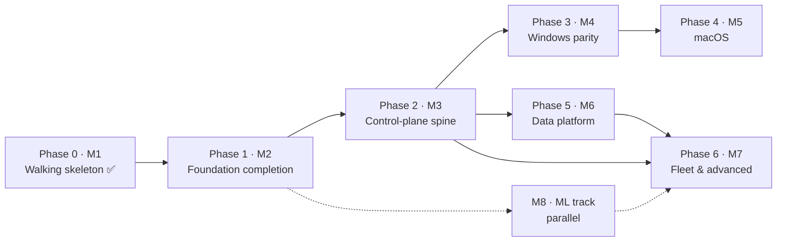

# Roadmap

Dependency-ordered development plan, derived from the interdependencies of all open
issues. **Two orderings, one structure:** the *phases* below are the dependency graph
(what unblocks what), and the GitHub *milestones* are those same phases (M1–M8), so an
issue's milestone is its phase. Work *within* a phase is parallel-safe; a phase starts
when the arrows into it land. Issue numbers are the source of truth for scope; this
file only orders them.

Last reviewed 2026-09-04.

## Milestones = phases

| Milestone | Phase | State |
| --- | --- | --- |
| M1 — Linux walking skeleton | Phase 0 | ✅ done |
| M2 — Foundation completion | Phase 1 | in progress |
| M3 — Control-plane spine | Phase 2 | not started |
| M4 — Windows parity | Phase 3 | sensor landed; lab + expansion open |
| M5 — macOS | Phase 4 | not started |
| M6 — Data & analytics platform | Phase 5 | not started |
| M7 — Fleet & advanced response | Phase 6 | not started |
| M8 — ML track | parallel throughout | inference landed; pipeline open |

Milestone numbers ascend with the dependency order. Every new issue is filed straight
into its phase's milestone.

## Current state

- **Done:** the whole Linux walking skeleton (M1), the detection engines (sigma,
  correlator, ML inference, store, enrich, yara), the Windows ETW sensor, the Python
  training pipeline, the review-findings hardening and Clean Code passes, and the
  self-protection primitives (sensor-silence heartbeat + self-integrity in `tamper`).
- **In flight (M2 / Phase 1):** foundation completion — everything agent-local and
  parallel-safe. This is where day-to-day work sits until the spine opens the fleet.
- **Next unlock:** Phase 2 (M3). Nothing in the backlog blocks as much as the
  control-plane spine.

## The critical path in one sentence

**`#23 policy → #24 transport + #28 server (+#89 auth) → #30 updater/rings → #77
datalake`** — every fleet-level feature hangs off this spine.

## Phase 0 — Walking skeleton ✅ (M1)

One synthetic event end to end on Linux: schema, eBPF probes + userspace loader, rule
engine, sinks, the agent binary, watchdog, lab harness. Complete. The detection
engines (M2's closed issues), the Windows ETW sensor (#20), the hardening passes, and
the `tamper` self-protection primitives also landed here, ahead of their nominal slots.

## Phase 1 — Foundation completion (M2) · all parallel, agent-local, no blockers

| Issue | Why now |
| --- | --- |
| #19 config | agent/watchdog/cli all want it; tiny; blocks nothing but tidies everything |
| #53 CO-RE ppid fix | every lineage rule is unreliable off the binding kernel until this lands; prerequisite for #62 blast-radius and #48 lineage features |
| #111 probe filename capture | same eBPF probe rebuild as #53 — do together; kills argv[0] spoofing and fixes enrich hashing the wrong file |
| #126 async enrichment | enrichment runs on the sensor drain thread; a cache miss stalls capture — move it off the hot path |
| #74 ATT&CK structured fields | schema+engines only; the earlier it lands, the less content needs retrofitting; #73 depends on it |
| #73 detection-as-code (metadata + negative samples) | content-side only; the ring-deployment half moves to Phase 2 (#30) |
| #34 audit fallback sensor | independent; a second Linux sensor makes #35 conformance meaningful |
| **Source collection** — #90 uprobes · #91 lsm · #92 netlink · #93 journal | new Linux telemetry taps: parallel-safe, validated on the lab; #91 opens the inline-blocking path #25 uses |
| #80 container context · #86 JA4/SNI · #84 device-control (telemetry half) · #87 inventory (agent half) | sensor-side collection; the server-side consumers arrive in Phase 5, the policy halves in Phase 6 |
| #36 packaging: Linux | unblocks realistic lab installs for every later phase's validation |
| #112 watchdog service hardening | agent-local (service args, quoting, absolute paths); pairs with packaging |
| #113 lab provisioning · #123 Alpine lab · #124 Arch lab | provisioning reliability + the musl and rolling-kernel test beds (#124 is the CO-RE #53 proving ground) |
| #114 schema version-bump contract | doc-only decision; the earlier it lands, the fewer schema additions get re-litigated |
| #71 tamper · #101 backoff · #102 liveness · #103 artifact protection · #104 spike | self-protection: the heartbeat + integrity primitives shipped; wiring them into the agent/watchdog and hardening the restart loop is the remaining work |

## Phase 2 — Control-plane spine (M3) · the great unblocker, mostly serial

1. **#23 policy** — response gating, posture overlays, content rings all speak it; first.
2. **#28 server scaffold + #89 better-auth/tenancy** — one PR train: tenancy shapes migration one (ADR-0003).
3. **#24 transport + #108 spool ack** — enrollment + spool flush against #28; mTLS per ADR-0001. The two-phase drain/ack (#108) lands here: the server is the first real consumer of drained segments.
4. **#30 updater + rings** — needs #24/#28; completes #73's content rings; prerequisite for #71's integrity manifest.
5. **#25 response** — needs #23 only; parallel to 2–4; Linux kill/quarantine first (the LSM block path arrives with #91).
6. **#26 ipc → #27 cli → #31 ui** — strictly ordered; ui also wants #25 for notifications.

## Phase 3 — Windows parity (M4) · needs Phase 1 lab discipline; independent of Phase 5

1. **#22 Windows lab harness** — gate for everything Windows; needs the x86 host.
2. **#20 ETW migration ✅** — code landed; lab validation on #22 still owed.
3. **#21 P2–P8 expansion · #94 eventlog · #97 DotNET/SMB providers** — parallel; code-unblocked now, validation wants #22.
4. **#37 packaging: Windows** — after #20 (services to install).
5. **#35 conformance suite** — honest once Linux (2 sensors) + Windows exist; generates the public capability matrix.

## Phase 4 — macOS (M5) · this Mac is the lab; after Phase 3 by team focus, not dependency

**#32 ES sensor → #96 ES widening → #33 NetworkExtension · #95 unifiedlog → #38 packaging**

## Phase 5 — Data & analytics platform (M6) · hard-gated on #28

1. **#77 datalake** — everything below reads it.
2. **#72 graph · #76 prevalence · #83 ops** — parallel projections/consumers.
3. **#61 hunt · #78 cloud-detection** — need #77 (+#72 for pivots).
4. **#29 export/SIEM · #88 integrations** — need #28 only; can start any time in this phase.

## Phase 6 — Fleet & advanced response (M7) · each item lists its true gates

| Issue | Gates |
| --- | --- |
| #60 intel | schema Ioc variant; distribution via #30; enrich ✅ |
| #62 fleet correlation + posture | #28, #72 joins, #23 overlays; quality wants #53 |
| #79 mesh | #24 PKI + #62 posture semantics |
| #63 response::live | #24 + #28 + #89 identities |
| #70 forensics | #63 (acquisitions) + #77 (artifact storage) |
| #64 disruption | #25 + #62 + #89 (+ directory connector) |
| #81 deception → #82 ransomware | #81 first; #82 also wants Windows rename/delete events (#39 or #21 partials) and #25 reflex |
| #84 device-control (enforcement half) | #23 policy; telemetry half done in Phase 1 |
| #85 memory scanning | Linux half after #91; Windows half gated on #39 (TI-ETW/PPL) |
| #75 assistant | #72 + cases in #28; pairs with #50 |
| #107 trusted-process identity | the path-trust gate shipped (PR #106); the durable signature + expected-parent check wants enrich publisher identity (#21 catalog chain) |
| #39 windows driver | long-term: signing/MVI gates; unblocks #85-win, #82 fidelity, handle-access |

## M8 — ML track (parallel throughout, owned alongside the shipped #13)

**#13 ✅ → {#109 format parity, #110 ort static linking} → #44 corpus (#67 ✅; wants
#36) → {#45 robustness, #46 conformal/OOD, #48 lineage features (wants #53)} → #49
per-site adaptation (wants #28 + #77) → #50 narratives (with #75)**. #47 attributions
is partially landed. #109/#110 come first: the corpus pipeline must read real agent
captures, and the deployed scorer must match ADR-0002 before anything is trained
against it. Each item lands in the phase where its dependencies exist; grouped as one
milestone because it is one continuous workstream.

## If one thread does everything

Phase 1 → Phase 2 first (foundation, then the spine). Phase 2 step 5 (#25 response) can
start as soon as #23 exists. Phase 3 (Windows) is calendar-gated on the x86 host — slot
it opportunistically. Phase 5 (data) follows the server (#28). Phase 6 by its gates
table. Phase 4 (macOS) last before any fleet-wide claim. #39 (driver) whenever the
signing path opens. The ML track runs alongside throughout.
